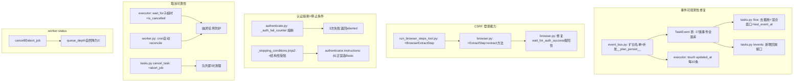

## 产品概述

基于 DVWA 测试任务 `4e68baab` 运行中暴露的 4 份分析报告，制定系统性修复计划，覆盖 6 个问题域：事件可观测性缺失、CSRF 表单登录能力缺失、认证失败死循环无熔断、协作式取消不可靠、worker-status 统计陈旧、AVFS 挂载阻塞。

## 核心问题与证据汇总

### 问题 1：事件可观测性缺失（报告 D）

- 问题：API `/live` 只暴露 4 类骨架事件，思考/LLM/工具/错误全不落库；工具调用截断 200 字；recent_events 固定 30 条窗口；updated_at 运行期不刷新。
- 证据：Worker 实际 91 次工具调用、34 次工具错误、383 条 LLM 思考——API 一个都看不到。Redis 396 条事件中 71%（285 条）API 完全不可见。

### 问题 2：CSRF 表单登录能力缺失（报告 B）

- 问题：BrowserStep 只支持静态 fill/select/check/click/press，无法"先抓页面隐藏 token 再回填"。DVWA 的 user_token 每次轮换，POST 缺 token 被拒。
- 证据：带 user_token 提交 → 302 index.php 成功；不带 → 302 login.php 失败。唯一差异是 user_token。

### 问题 3：认证失败死循环无熔断（报告 A）

- 问题：agent 在登录环节卡死 33 分钟从未进入漏洞测试。缺少"结构性受阻"停止类别，LLM 把"换方法重试"当不同任务不累计 attempts。
- 证据：authenticator 被调用 4 次、requester 6 次、exploit_web_agent 0 次。input tokens 155 万。MAX_TASK_ATTEMPTS=3 形同虚设。

### 问题 4：协作式取消不可靠（报告 C）

- 问题：cancel 返回 200 但任务不停，worker 协程被 LLM 死循环占用时检查点到不了。任务变幽灵任务。
- 证据：cancel 后 status 仍 running、cancel_requested 仍 None。最终靠 task-reconcile 强制终止。

### 问题 5：worker-status 统计陈旧（报告 C）

- 问题：queue_depth 在任务终止后仍报 1，时间戳停在任务启动时。取消后未清理 ARQ 队列项。
- 证据：任务已 cancelled 后 worker-status 仍报 queue_depth:1，stats.detail 时间戳停在 06:55:26。

### 问题 6：AVFS 挂载阻塞（报告 D 顺带）

- 问题：全任务 131 次 `AVFS workspace 'memory' is not mounted` 报错，基础设施阻塞导致实时 HTTP agent 失效。
- 证据：Worker 日志 131 次该报错贯穿全程。

## 技术栈

- 后端：Python 3.12 + FastAPI + SQLAlchemy (async) + ARQ (Redis 任务队列)
- Agent 引擎：pobi_agent (多智能体协作 + Pydantic AI + Pydoll CDP 浏览器)
- 数据库：PostgreSQL (TaskEvent 表) + Redis (事件总线 pub/sub + ARQ 队列 + cancel_state)
- 提示词：Jinja2 模板 (pobi_prompts/)
- 部署：Docker (dev: docker-compose, prod: Dockerfile.prod 多阶段构建)

## 实现方案

### 方案 1：扩大事件落库白名单 + 去截断 + 修复 updated_at 冻结（问题 1）

**策略**：三层并行修复——落库白名单、API 截断/窗口、任务记录刷新。

**1a. 扩大 persist_event_worker 白名单**

`pobi_v2/engine/event_bus.py:351-358` 的 `persist_event_types` 从 7 类扩展到全量 17 类：

```python
persist_event_types = {
    # 原有骨架
    "plan_step", "phase_changed", "agent_start", "agent_end",
    "tool_call_start", "tool_call_end", "report_task_event",
    # 新增明细（agent 思考与 LLM 过程）
    "agent_thought", "agent_error", "agent_routed",
    "llm_iteration", "llm_input", "llm_response",
    "confidence_update", "validation_result",
    "task_created", "task_expanded", "task_status_changed",
    "log",
}
```

同时对新增的明细事件（agent_thought / llm_*）在 emit 时额外发布到 `__plan_persist__` 通道（当前只对骨架事件做 `bus.publish("__plan_persist__", payload)`）。修改 `emit_agent_thought`、`emit_llm_iteration`、`emit_llm_input`、`emit_llm_response`、`emit_agent_error`、`emit_agent_routed`、`emit_confidence_update`、`emit_validation_result`、`emit_log_message`、`emit_task_created`、`emit_task_expanded`、`emit_task_status_changed` 各加一行 `asyncio.create_task(bus.publish("__plan_persist__", payload))`。

`tool_call_start/end` 也需同步补发到 `__plan_persist__`（当前缺失，导致 Redis 流里也没有工具调用事件）。

**性能考量**：明细事件高频（本次 396 条/50 分钟，峰值约 8 条/分钟），TaskEvent 表已有 seq 索引，写入开销可控。为防极端高频任务撑大表体积，对 `llm_input`/`llm_response`/`agent_thought` 的 payload 在落库时复用已有的 `_truncate`（2000/3000/2000 字），不做额外截断。

**1b. 去截断 + 窗口优化**

`pobi_v2/routers/tasks.py:417-423` 的 `agent_work` 截断从 200 字提到 2000 字：

```python
entry["args"] = (p.get("args") or "")[:2000]
# ...
entry["error"] = str(p.get("error"))[:2000]
entry["result"] = (p.get("result") or "")[:2000]
```

`recent_events` 窗口从固定 30 改为按类型混合保留：各类事件各保留最近 N 条（骨架类 10、明细类 10），上限 60。实现方式：查询时按 type 分组各取最近 N 条再合并排序，而非简单 `.limit(30)`。

**1c. 修复 updated_at 冻结**

在 `persist_event_worker` 每次落库后顺带 `touch` 任务的 `updated_at`。为避免每条事件都写一次（高频写库），采用每 10 条事件刷新一次的节流策略：

```python
# 在 persist_event_worker 的 try 块内，record_task_event 之后
await session.execute(
    update(Task)
    .where(Task.id == task_uuid)
    .values(updated_at=datetime.now(timezone.utc))
)
```

同时 `/live` 新增派生字段 `last_event_at`（最近一条事件时间），前端据此显示"最后活跃 Xs 前"。

**1d. 新增事件回放接口**

新增 `GET /api/v1/tasks/{task_id}/events?type=&after_seq=&limit=` 从 TaskEvent 表读取历史全量，供控制台时间线回看，弥补 SSE 断连即丢的缺陷。

### 方案 2：BrowserStep 增加 extract 步骤类型（问题 2）

**策略**：在浏览器步骤模型中新增 `extract` action，支持从页面提取隐藏字段值写入 context，后续步骤可引用。

**2a. 新增 BrowserExtractStep Pydantic 模型**

`pobi_agent/tools/browser/run_browser_steps_tool.py` 新增：

```python
class BrowserExtractStep(BaseModel):
    action: Literal["extract"] = "extract"
    selector: str = Field(..., description="CSS selector for the element to extract value/text from.")
    key: str = Field(..., description="Context key to store the extracted value under.")
    attribute: str | None = Field(default="value", description="Attribute to extract (value/text/html/checked). Default: value.")
```

Union 类型 `BrowserStep` 加入 `BrowserExtractStep`。

**2b. BrowserSession 实现 extract**

`pobi_agent/tools/browser/browser.py` 新增 `ExtractStep` dataclass 和 `extract_from_context` 方法。在 `run_steps` 的 dispatch 中增加 `ExtractStep` 分支：用 `_query_one` 定位元素，通过 `tab.execute_script` 读取 `element.value` / `element.textContent` / `element.innerHTML`，写入 context dict。

**2c. HTML 解析兼容单引号**

`extract` 的 CSS selector `input[name='user_token']` 已天然兼容单引号属性（CSS selector 规范支持单双引号）。无需额外 HTML 正则修改。

**2d. 修复验证层假阳性**

`pobi_agent/tools/browser/browser.py:596-658` 的 `wait_for_auth_success`：当 `checks_configured=False` 时，不兜底 `success=true`，改为 `success=false` + `error="No explicit success condition configured; cannot verify auth"`。同时 `_persist_and_summarise` 在 `success=false` 时不写 `validated=true`。

### 方案 3：认证熔断 + 结构性受阻停止条件（问题 3）

**策略**：代码层硬熔断（不依赖 LLM 自觉）+ 提示词层新增停止类别。

**3a. 认证连续失败熔断**

在 `pobi_agent/tools/browser/authenticate.py` 的 `authenticate_service` 入口处增加基于 `target + profile` 的调用级失败计数器。计数器存于进程内 dict（键 `f"{target}:{profile}"`），连续 `success=false` 达 3 次即拒绝再试并返回 `aborted=true`。

```python
_AUTH_FAIL_LIMIT = 3
_auth_fail_counter: dict[str, int] = {}

def _check_auth_circuit(target: str, profile: str) -> dict | None:
    key = f"{target}:{profile}"
    if _auth_fail_counter.get(key, 0) >= _AUTH_FAIL_LIMIT:
        return {
            "success": False, "aborted": True,
            "error": f"认证连续失败达上限({_AUTH_FAIL_LIMIT}次)，疑似框架不支持该登录形态，停止重试",
        }
    return None

# 在 authenticate_service 开头
circuit = _check_auth_circuit(target, profile)
if circuit:
    return circuit

# 在每个 _authenticate_via_* 返回后
if not result.get("success"):
    _auth_fail_counter[f"{target}:{profile}"] = _auth_fail_counter.get(key, 0) + 1
else:
    _auth_fail_counter.pop(key, None)  # 成功则清零
```

**3b. 提示词新增"结构性受阻"停止类别**

`pobi_prompts/_shared/_stopping_conditions.jinja2` 在错误条件中增加：

```
### 结构性受阻（停止并终止任务）
- 同一前置步骤连续失败，且失败根因属于框架/工具能力缺陷而非目标防御
  例如：工具参数无法被序列化执行、需动态 CSRF token 但无抓取手段、
  认证流程反复 success=false 且 final_url 始终停在登录页
  → 判定为"当前框架无法完成"，立即停止，返回 status: "aborted"，
    并在 detailed_summary 中写明受阻根因，交人工介入，不要无限重试。
```

**3c. 提示词纠正误选 Basic**

`pobi_prompts/authenticator.instructions.jinja2` 明确：有登录表单（HTML form）的目标必须走 `form` 流程，`http`（Basic）仅用于无表单的 HTTP Basic 保护端点；增加 CSRF 专项指引。

### 方案 4：协作式取消可靠性增强（问题 4）

**策略**：在现有协作式取消基础上增加超时兜底 + 心跳检测。

**4a. executor 增加定期取消检查**

`pobi_v2/engine/executor.py` 的 `_run_task_body` 在 DeadEndAgent 运行结束后已有 `is_cancelled` 检查（line 282）。关键缺口是运行期间无检查点。

由于 `run_deadend_agent` 是一个完整阻塞调用，无法在其内部插入检查点（不修改 pobi_agent 核心代码）。替代方案：用 `asyncio.wait_for` 包裹 `run_deadend_agent` 设一个可配置的子超时（如 30 分钟），超时后检查 `is_cancelled`，若已取消则终止，否则继续（用 `asyncio.shield` 保护防止任务被意外取消）。

**4b. cancel_task 端点增强**

`pobi_v2/routers/tasks.py:214-242` 的 `cancel_task`：在写入 cancel 标志后，立即检查任务是否在 ARQ 队列中（复用 `system.py` 的 `_job_in_queue`），若在队列中则尝试 `arq.redis.abort_job(task_id)` 从队列移除。

**4c. task-reconcile 定期自动执行**

在 ARQ Worker 配置中增加 cron job，每 5 分钟自动执行 `task_reconcile`，及时发现幽灵任务。`pobi_v2/engine/worker.py` 增加：

```python
async def _auto_reconcile(ctx):
    from pobi_v2.routers.system import task_reconcile
    await task_reconcile()

class WorkerSettings:
    # ...
    cron_jobs = [cron(_auto_reconcile, hour=None, minute={0, 5, 10, 15, 20, 25, 30, 35, 40, 45, 50, 55})]
```

### 方案 5：worker-status 统计刷新（问题 5）

**策略**：cancel 时清理队列项 + worker-status 基于真实队列计算。

**5a. cancel 时清理 ARQ 队列**

在方案 4b 的 `cancel_task` 增强中已覆盖：cancel 成功后调用 `arq.redis.abort_job(task_id)` 从 `arq:queue` 移除该 job，queue_depth 自然下降。

**5b. worker-status 基于 zcard 实时计算**

`pobi_v2/routers/system.py:69` 已用 `redis.zcard("arq:queue")` 获取队列深度，本身是实时的。问题根因是 cancel 后未从队列移除 job（方案 4b/5a 修复后自然解决）。

### 方案 6：AVFS 挂载排查（问题 6）

**策略**：排查 avfs_mount 工具注册与挂载流程，作为独立 issue 跟进。本次修复计划中列为最低优先级，先排查根因再定方案。

## 架构设计



## 目录结构

```
pobi_v2/
├── pobi_v2/
│   ├── engine/
│   │   ├── event_bus.py          # [MODIFY] 扩大 persist_event_types 白名单至17类；明细事件 emit 补发 __plan_persist__；persist_event_worker 每10条 touch updated_at
│   │   ├── executor.py           # [MODIFY] run_deadend_agent 包裹 asyncio.wait_for 子超时+is_cancelled 检查
│   │   └── worker.py             # [MODIFY] 增加 cron_jobs 自动 task_reconcile（每5分钟）
│   ├── routers/
│   │   ├── tasks.py              # [MODIFY] /live 去截断(200→2000)+混合窗口(30→60按类型)；/cancel 增加 abort_job；新增 GET /events 回放接口
│   │   └── system.py             # [MODIFY] worker-status 无需改动（zcard已实时），cancel 路径已在上游修复
│   └── schemas/
│       └── task.py               # [MODIFY] TaskLiveState 增加 last_event_at 字段；新增 EventReplay schema
pobi_agent/
├── tools/browser/
│   ├── browser.py                # [MODIFY] 新增 ExtractStep dataclass + extract_from_context 方法 + run_steps dispatch；修复 wait_for_auth_success 假阳性
│   ├── run_browser_steps_tool.py # [MODIFY] 新增 BrowserExtractStep Pydantic 模型 + Union 类型
│   └── authenticate.py           # [MODIFY] authenticate_service 入口增加 _auth_fail_counter 熔断逻辑（3次失败返回aborted）
pobi_prompts/
├── _shared/
│   └── _stopping_conditions.jinja2  # [MODIFY] 新增"结构性受阻"停止类别
└── authenticator.instructions.jinja2 # [MODIFY] 纠正误选 Basic，增加 CSRF 专项指引
```

## 关键代码结构

```python
# BrowserExtractStep — 新增的 CSRF token 抓取步骤类型
class BrowserExtractStep(BaseModel):
    """从页面元素提取值/文本写入 context，供后续步骤引用。

    典型用法：先 extract 抓 user_token，再 fill 回填到提交表单。
    """
    model_config = {"extra": "forbid"}
    action: Literal["extract"] = "extract"
    selector: str = Field(
        ...,
        description="CSS selector for the element to extract value/text from (e.g. input[name='user_token']).",
    )
    key: str = Field(
        ...,
        description="Context key to store the extracted value under; subsequent fill/select steps can reference it.",
    )
    attribute: Literal["value", "text", "html", "checked"] = Field(
        default="value",
        description="What to extract: element.value (default), textContent, innerHTML, or checked state.",
    )

# 认证熔断计数器
_AUTH_FAIL_LIMIT = 3
_auth_fail_counter: dict[str, int] = {}

def _check_and_increment_auth_failure(target: str, profile: str, failed: bool) -> dict | None:
    """连续认证失败熔断：达上限返回 aborted 结构化失败，不把球踢回 LLM。"""
    key = f"{target}:{profile}"
    if failed:
        _auth_fail_counter[key] = _auth_fail_counter.get(key, 0) + 1
        if _auth_fail_counter[key] >= _AUTH_FAIL_LIMIT:
            return {
                "success": False, "aborted": True,
                "error": f"认证连续失败达上限({_AUTH_FAIL_LIMIT}次)，疑似框架不支持该登录形态，停止重试",
            }
    else:
        _auth_fail_counter.pop(key, None)
    return None
```

## 实现注意事项

- **性能**：persist_event_worker 白名单扩大后，高频任务（如本次 396 条/50min）的 TaskEvent 写入频率约 8 条/分钟，PG 承受无压力。但需注意 `_truncate` 已在 emit 层截断（llm_input 2000 字 / llm_response 3000 字 / agent_thought 无截限），落库 payload 不会过大。
- **向后兼容**：新增 BrowserExtractStep 是 Union 类型扩展，不影响已有 fill/select/check/click/press 步骤。`_auth_fail_counter` 是进程内 dict，Worker 重启自然清零（可接受——跨进程熔断需 Redis 支持，但当前单 Worker 场景进程内足够）。
- **blast radius**：修改 `_stopping_conditions.jinja2` 影响所有 agent 的停止决策，新增类别是加法不删减已有规则，风险低。修改 `wait_for_auth_success` 假阳性会使得原本"兜底成功"的认证变为显式失败——这是正确行为（当前假阳性更危险），但可能导致部分原本"误打误撞成功"的认证流程暴露问题，需在修改后回归测试已有目标。
- **AVFS 排查**：方案 6（AVFS 挂载）不在此计划代码修改范围内，需单独排查 `pobi_agent` 的 avfs_mount 工具注册与 `pobi_v2/sandbox/sandbox.py` 的挂载流程，另立 issue。

## Agent Extensions

### SubAgent

- **code-explorer**
- Purpose: 在实现阶段需要跨文件追溯调用链时使用（如确认 persist_event_worker 的 **plan_persist** 订阅者、BrowserStep Union 类型的所有引用点、authenticate_service 的所有调用方）
- Expected outcome: 确保修改不遗漏上游引用，避免回归