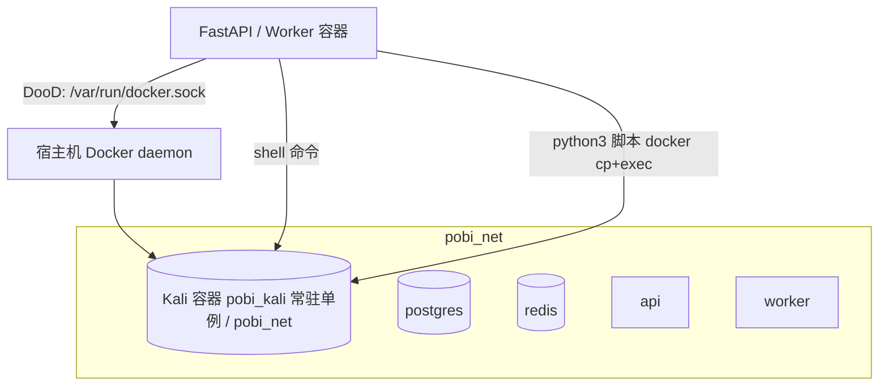

## 用户需求

去除项目中独立的 Python 执行沙箱机制（基于 `python_sandbox_client` 的 Deno/Pyodide WASM worker 池），将 Python 脚本验证改为由统一的 Kali Docker 容器执行；并推进全面容器化，启动后定义统一 Docker 网络，所有组件均运行在 Docker 中。

## 产品概述

Pobi v2 是一个 AI 渗透测试 Web 平台。当前存在两套执行沙箱：一套基于 Docker 的 Kali 容器（shell 攻击命令），一套基于 Deno/Pyodide WASM 的 Python 沙箱（`python_sandbox_client`，专供 `python_interpreter` 工具生成并执行 Python 验证脚本）。本次改造将 Python 执行并入 Kali 沙箱，并让平台全面 Docker 化：Kali 作为 compose 常驻单实例容器，API/Worker 经 Docker-out-of-Docker 复用宿主机 Docker daemon，所有服务处于同一自定义网络。

## 核心特性

- 去除 Python 沙箱链路：`run_python_file` 不再通过 `python_sandbox_client` 执行，改为将脚本复制到全局 Kali 容器并以 `python3` 运行。
- 全局共享 Kali 容器：compose 中常驻一个 Kali 容器（单实例），shell 命令与 Python 验证共用同一容器，生命周期随 compose。
- 全面容器化：API/Worker 容器内挂载 `/var/run/docker.sock` 实现 DooD，所有服务接入统一网络 `pobi_net`。
- 启动自动就绪：应用启动（`lifespan`）或 Worker 启动时确保全局 Kali 容器存在并处于 Running（不存在则创建并接入 `pobi_net`，已存在则复用）。
- 网络收敛：原 `Sandbox` 默认 `network="host"` 收敛为 `pobi_net`，跨容器访问经服务名（postgres/redis/api）。

## 技术栈选择

- 后端：FastAPI（pobi_v2）+ 内核 pobi_agent（沿用既有架构）
- 容器编排：Docker Compose（新增 kali service、统一网络、DooD 挂载）
- 沙箱执行：复用既有 `pobi_agent.sandbox.Sandbox`（Docker `exec_run`，原 Kali 镜像已含 python3/sqlmap/nmap 工具链）
- 语言：Python 3.12（与项目一致）；DooD 依赖宿主机 Docker CLI 与 daemon

## 实现方案

### 总体策略

将「每任务独立容器 + WASM Python 沙箱」重构为「compose 常驻单实例 Kali 容器 + DooD 复用」。核心是把全局 Kali 容器抽象为一个进程级单例（`SharedKaliSandbox`），`run_python_file` 与 `ShellRunner` 都向它发命令。Python 脚本通过 `docker cp` 写入容器后 `exec_run("python3 /path/xxx.py")`，复用 `Sandbox.execute_command` 已有能力，避免新写执行通道。

### 关键技术决策

1. **全局共享容器单例**：在 `SandboxManager` 新增 `get_or_create_shared_kali()`，按固定容器名（如 `pobi_kali`）解析；不存在则 `containers.run(name=..., network=pobi_net, detach=True, tty=True)`，存在则 `containers.get` 复用。保证 API 进程与 Worker 进程各自持有一个连接，但底层是同一容器。
2. **Python 执行走 Kali 而非 WASM**：`run_python_file` 改为：写文件到宿主机临时目录 → `docker cp` 进 Kali 容器 `/pobi_scripts/` → `Sandbox.execute_command("python3 /pobi_scripts/<filename>")` → 回读 stdout/stderr。保留原有结果落盘（`_save_result_to_file`）与截断逻辑。
3. **DooD 而非 Docker-in-Docker**：API/Worker 镜像内 `docker.from_env()` 需访问宿主机 daemon，故 compose 挂载 `/var/run/docker.sock`；镜像需含 `docker` CLI（Dockerfile 多阶段构建中运行时层安装）。Kali 容器本身由宿主机 daemon 创建，位于 `pobi_net`。
4. **网络收敛**：`config.sandbox_network = "pobi_net"`；`Sandbox.start` 与 `SandboxManager.create_sandbox` 默认 `network_name` 改为该值；compose 顶层的 `pobi_net` 为 `bridge` 驱动，kali/api/worker/postgres/redis 均加入。
5. **去除 Python 沙箱依赖**：停用 `PythonInterpreter`（python_sandbox_client）调用链；保留 `python_sandbox_client` 目录但不再被 import，避免大范围破坏性删除引发回归；在 `pyproject.toml` 与 `setup.sh` 中移除其下载/打包步骤。

### 性能与可靠性

- 全局单容器避免每任务起停容器开销（原每任务 create+start 约数百毫秒至数秒），降低 daemon 压力。
- `run_python_file` 的 `docker cp` + `exec_run` 为同步阻塞（Docker SDK 非异步），需用 `asyncio.to_thread` 包裹避免阻塞事件循环（参考 `Sandbox.execute_command` 为同步方法，现有调用点均在 async 上下文中，须保持一致做法）。
- 容器就绪检查：`lifespan`/Worker 启动时对 Kali 容器做 health check（exec_run `echo ok`），失败则明确报错（保持原沙箱缺失即报错的 fail-fast 行为）。
- 共享容器并发：`Sandbox.execute_command` 内部 `container.exec_run` 是串行 exec（非流式场景），多任务并发调用同一容器时需加 `asyncio.Lock` 防止 stdout/stderr 交错；原 `ShellRunner` 为单 deps 实例，需确认锁粒度覆盖全局共享实例。

### 避免技术债务

- 复用既有 `Sandbox`/`SandboxManager` 而非新写执行层，保持 `pobi_agent` 内核不被破坏（符合 AGENTS.md「engine 编排、内核不感知平台」边界）。
- 配置项集中到 `pobi_v2.core.config.Settings`（sandbox_image / sandbox_network / kali_container_name），不散落硬编码。

## 实现要点（执行细节）

- 修改 `Sandbox.start`：新增 `attach_existing(container_name)` 类方法/可选参数，支持按名称连接已存在容器（用于共享单例），而非总是新建。
- `deadend_runner._prepare_env_dependencies`：由 `sandbox_manager.create_sandbox()` 改为 `sandbox_manager.get_or_create_shared_kali()`，返回的 `Sandbox` 传入 `prepare_dependencies`。
- `run_python_file`：移除 `PythonInterpreter` 实例化；改为接收共享 `Sandbox`（经 deps 或模块级单例）执行 `python3`。
- 保持 `allow_shell_exec` / 审批护栏（fail-closed）不变，沙箱只是执行载体变化，安全闸门不弱化。
- 更新 `setup.sh`：移除 python-sandbox-worker 下载段落；保留 kali 镜像 pull，但改为确保 compose 拉起即可。
- 更新 `start-prod.sh`：compose up 顺序确保 kali 服务 healthy 后再起 api/worker（用 `depends_on` + healthcheck 或 `docker compose up kali` 前置）。

## 架构设计

### 改造后组件关系



### 数据流（一次任务）

1. 应用启动 → `lifespan` 确保 `pobi_kali` 容器在 `pobi_net` 中 Running（API 与 Worker 各自进程内单例）。
2. 任务入队 → Worker 取任务 → `deadend_runner` 获取共享 Kali `Sandbox` 单例 → `prepare_dependencies(sandbox=...)`。
3. Supervisor 调度 `shell` 工具：`ShellRunner.run_command` → `Sandbox.execute_command`（Kali 内 bash）。
4. Supervisor 调度 `python_interpreter` 工具：`run_python_file` → 写文件 → `docker cp` → `Sandbox.execute_command("python3 ...")`（同一 Kali 容器）。
5. 结果经 event_bus 回写 PG + SSE。

## 目录结构

```
docker-compose.yml                 # [MODIFY] 新增 kali service；统一 pobi_net 网络；
                                    #          api/worker 挂载 /var/run/docker.sock；
                                    #          kali healthcheck + depends_on 顺序
Dockerfile.prod                     # [MODIFY] 运行时层安装 docker CLI（DooD 需要）；
                                    #          保持多阶段构建；保留 python_sandbox_client 拷贝删除
pobi_v2/
├── core/config.py                  # [MODIFY] Settings 新增 sandbox_network(=pobi_net)、
                                    #          kali_container_name(=pobi_kali)
├── main.py                         # [MODIFY] lifespan 启动阶段确保全局 Kali 容器就绪
                                    #          （共享单例初始化，失败 fail-fast）
└── engine/
    └── deadend_runner.py           # [MODIFY] _prepare_env_dependencies 改用
                                    #          sandbox_manager.get_or_create_shared_kali()
                                    #          不再每任务 create_sandbox
pobi_agent/
├── sandbox/
│   ├── sandbox.py                  # [MODIFY] start 默认 network 改 pobi_net；
│   │                              #          新增 attach_existing(container_name) 连接已存在容器
│   └── sandbox_manager.py          # [MODIFY] create_sandbox 默认网络改 pobi_net；
│                                  #          新增 get_or_create_shared_kali() 单例方法
└── tools/
    └── python_interpreter/
        ├── __init__.py             # [MODIFY] run_python_file 改为 docker cp + 共享
        │                          #          Kali 容器 python3 执行，去除 PythonInterpreter 调用
        └── python_interpreter.py   # [MODIFY] PythonInterpreter 标记废弃，不再被 import
                                    #          （保留文件兼容，移除 python_sandbox_client 依赖）
python_sandbox_client/              # [MODIFY] 停止被引用；保留目录但清理打包引用
pyproject.toml                      # [MODIFY] 移除 python_sandbox_client 打包声明与注释
setup.sh                            # [MODIFY] 删除 python-sandbox-worker 下载段落
start-prod.sh                       # [MODIFY] compose up 前确保 kali service ready
```

## Agent Extensions

### SubAgent

- **code-explorer**
- Purpose: 在生成详细实现前，跨文件确认 `run_python_file` 调用链、`Sandbox` 所有调用点、以及 `docker.from_env()` 在容器化后的行为边界，避免遗漏仍引用 `python_sandbox_client` 的位置。
- Expected outcome: 产出完整的引用清单（哪些文件 import 了 `python_sandbox_client` / `PythonInterpreter`），确认共享 Kali 单例的注入路径无遗漏，指导安全移除。