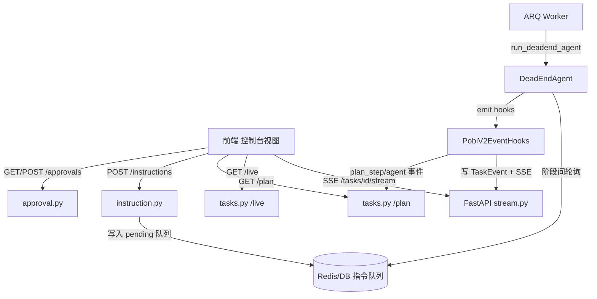

## 用户需求概述

在 Pobi v2 AI 渗透测试平台中，参照截图实现「渗透任务实时监控控制台」，用于查看运行中 Worker 对某个渗透任务的具体工作。控制台采用全屏三栏布局。

## 核心功能

- **执行计划（左栏）**：通过后端结构化接口返回任务被分解为的穿透步骤清单，每步含状态（待执行/进行中/已完成/已失败），前端以可勾选/高亮列表与进度条呈现。
- **当前阶段 + 正在执行的内容（中栏）**：以「主控 Agent 对话流」形式展示 Agent 的思考、工具调用、验证结果、阶段流转；顶部显示当前阶段与正在执行的智能体，通过 SSE 实时刷新。
- **对主控 Agent 追加指令（中栏底部）**：提供指令输入框，提交后真实干预运行中的 Agent（后端维护 per-task 待执行指令队列，Worker 主循环轮询注入为新的 supervisor 子任务），并在对话流中以用户消息气泡呈现。
- **审批（右栏）**：展示当前任务关联的审批请求（高危工具调用），含攻击范围与审批记录，待审项支持批准/拒绝，复用现有 fail-closed 审批链路。
- **任务头**：顶部显示目标 URL、目标描述、执行模式标签（hacker/yolo）、状态徽标、中断/继续控制。

## 技术栈选择

- 后端：沿用现有 FastAPI + SQLAlchemy 2.0 + Pydantic Schema；多租户隔离（`tenant_id`）；事件经 `PobiV2EventHooks` 写入 `TaskEvent` 并 SSE 推送。
- 前端：沿用现有 `web/`（vanilla JS，零构建，`index.html` + `app.js` + `styles.css`），新增控制台视图与三栏渲染、SSE 联动、指令提交。
- 指令注入通道：复用 Redis（已用于 ARQ/事件总线）或 `cancel_state` 同构的进程/Redis KV 存储，维护 per-task pending instructions 队列；Worker 主循环阶段间轮询。

## 实现方案

### 总体策略

保持现有事件钩子与审批链路不变，新增三层薄能力：(1) 结构化执行计划落库+聚合端点；(2) 任务实时状态聚合端点 `/live`；(3) 指令注入通道（POST 写队列 + Worker 轮询消费）。前端用全屏三栏视图替换原抽屉式 `openTaskDetail`，SSE 实时联动计划/对话/审批。

### 关键技术方案与权衡

1. **执行计划结构化**：引擎在 `threat_model` 返回 recon_report、`run_exploitation` 启动时，通过 `PobiV2EventHooks.emit_task_expanded` 或新增 `emit_plan_step` 把主目标拆解为有序步骤（task_id、seq、title、status）。DB 复用 `TaskEvent`（新增 `plan_step` 事件类型，payload 含 step_id/title/status），避免新增表；聚合端点 `GET /api/v1/tasks/{id}/plan` 解析返回 `PlanStep[]`。状态更新由后续 `task_status_changed` / `agent_end` 事件回填。

- 权衡：复用 `TaskEvent` 零迁移、SSE 同源；缺点是需前端/后端约定 payload 结构，故在 `schemas/task.py` 明确 `PlanStep` 模型保证契约。

2. **实时状态 `/live`**：`GET /api/v1/tasks/{id}/live` 返回 `{ status, current_agent, current_phase, recent_events[], plan_summary }`，由后端聚合 `Task` + 最新 N 条 `TaskEvent`；前端进入控制台即拉取，并以 SSE `snapshot` + 事件增量更新，避免轮询压力。
3. **指令注入（真正干预）**：新增 `TaskInstruction` 轻量模型（或复用 Redis list）存 `{task_id, instruction, created_by, status}`；`POST /api/v1/tasks/{id}/instructions` 写入 pending。`run_deadend_agent` 的 `run_exploitation` 循环中插入 `await drain_instructions(task_id)` 检查点——将待执行指令作为追加子目标注入 supervisor context（或调用 `agent.run_exploitation` 续跑段）。`DeadEndAgent.interrupted` 标志可复用实现协作式暂停/继续。

- 权衡：在阶段间插入检查点改动最小、风险可控；若 `run_exploitation` 内部不可中断，则降级为「下一轮 supervisor 迭代前注入」，并在前端明确「指令将在下一阶段生效」，保证可落地且不破坏现有引擎稳定性。

4. **审批右栏**：复用 `GET /api/v1/approvals?task_id={id}`（在 `approval.py` router 增加 `task_id` 过滤参数，保持现有 schema），展示待审/已审；按钮复用 `POST /api/v1/approvals/{id}/decision`。
5. **控制台布局**：顶部任务头 + 三栏 CSS Grid（左 280px 执行计划、中 1fr 主控对话、右 320px 审批/范围）。沿用现有 `--bg/--bg-2/--primary` 暗色令牌与 glassmorphism 卡片风格；对话流复用 `.live-stream` 视觉语言扩展为气泡式。

### 性能与可靠性

- SSE 已为实时主通道，计划/对话/审批均以增量事件更新，避免高频轮询。
- `TaskEvent` 查询加 `task_id` 索引（模型已建）与 `limit` 上限；`/live` 仅取最近 30 条。
- 指令队列用现有 Redis/进程存储，写失败不影响主流程（显式 try/except，安全降级）。
- 多租户：所有新增端点复用 `get_current_user` 并以 `tenant_id` 过滤，禁止跨租户读取。

## 实现注意事项

- 新增 `plan_step` 事件类型需在 `PobiV2EventHooks` 与前端 `appendEvent` 同时识别，保持 SSE 契约一致。
- 指令端点需校验任务处于 `running` 状态，否则返回 409（与现有 cancel 校验一致）。
- 复用现有 `esc()`、`openDrawer`/`api()`、`connectEventStream` 等工具，不新增重复封装。
- 后端新增端点均需 `Depends(get_current_user)` + `tenant_id` 隔离，遵循 `routers` 现有模式。

## 架构设计



## 目录结构与关键文件

```
pobi_v2/
├── schemas/task.py              # [MODIFY] 新增 PlanStep、TaskLiveState、TaskInstruction 响应/请求模型
├── db/models.py                # [MODIFY] 新增 TaskInstruction 模型（task_id/instruction/status/tenant_id）
├── engine/agent_adapter.py     # [MODIFY] PobiV2EventHooks 新增 emit_plan_step；保证 plan_step 写 TaskEvent+DB
├── engine/deadend_runner.py    # [MODIFY] run_exploitation 插入 drain_instructions 检查点，消费 pending 指令
├── engine/executor.py          # [MODIFY] 透传指令通道；调用 deadend_runner 时挂载指令队列读取
├── engine/instruction_channel.py # [NEW] per-task 待执行指令队列读写（Redis/进程，沿用 cancel_state 模式）
├── routers/tasks.py            # [MODIFY] 新增 GET /{id}/plan、GET /{id}/live
├── routers/instruction.py      # [NEW] POST /api/v1/tasks/{id}/instructions（校验 running + 租户隔离）
├── routers/approval.py         # [MODIFY] list_approvals 增加 task_id 过滤参数
web/
├── index.html                  # [MODIFY] 新增任务控制台全屏视图容器（三栏骨架）
├── static/js/app.js            # [MODIFY] 新增 openTaskConsole()、渲染三栏、SSE 联动、指令提交、审批内嵌
├── static/css/styles.css       # [MODIFY] 新增控制台三栏布局、对话气泡、计划进度、审批卡片样式
```

## 关键代码结构（契约）

```python
# schemas/task.py 新增
class PlanStep(BaseModel):
    step_id: str
    title: str
    status: str  # pending|running|completed|failed
    seq: int

class TaskLiveState(BaseModel):
    status: str
    current_agent: str | None
    current_phase: str | None
    recent_events: list[dict]
    plan: list[PlanStep]

class TaskInstructionIn(BaseModel):
    instruction: str = Field(..., min_length=1, max_length=2000)
```

## 设计风格

沿用项目现有 Apple 暗色工具主题（Absolute Black 画布 + Graphite 阶梯 + Apple Action Blue 唯一行动色），参照截图打造全屏三栏渗透任务控制台，采用 glassmorphism 卡片、柔和光晕、微动效，确保专业、克制且具备高级感。

## 页面规划（单页多区块）

顶部任务头：目标 URL + 目标描述 + 执行模式标签（hacker/yolo）+ 状态徽标 + 中断/继续按钮 + 关闭返回。

左栏「执行计划 / 运行视图」：

- 执行计划区块：有序步骤列表，每步含序号、标题、状态徽标（待执行/进行中/已完成/失败），顶部总进度条。
- 智能体运行区块：参与 Agent 列表（主控/侦察/利用…）及当前运行状态点。

中栏「主控对话」：

- 阶段标题（如「威胁建模」「利用循环」）与当前正在执行的智能体。
- 对话流：AI 消息气泡（思考/工具调用/验证结果/报告），用户指令以右侧高亮气泡呈现；复用 live-stream 视觉语言扩展为气泡式，自动滚动到底。
- 底部指令输入区：文本框 + 发送按钮「给主控发送新的指令或追问…」，Enter 提交。

右栏「攻击范围 / 审批」：

- 攻击范围区块：目标 URL、授权范围 chips、排除范围。
- 审批范围区块：需审批的高危工具名单（如 custom_exploit / dangerous_docker_exec）。
- 审批记录区块：当前任务待审/已审列表，待审项含批准/拒绝按钮。

## 交互与响应式

- 三栏 Grid：左 280px（执行计划）、中 1fr（对话）、右 320px（审批）；窄屏降级为纵向堆叠。
- hover 微动效：卡片描边提亮、按钮实况按压；状态点呼吸光晕。
- 实时性：进入控制台即建立 SSE，计划/对话/审批增量刷新；指令提交后即时以气泡回显并提示「将在下一阶段生效」。

## Agent Extensions

### Skill

- **前端美化**
- Purpose: 指导全屏三栏控制台的视觉与交互设计，确保达到生产级 UI 质感（glassmorphism、微动效、信息层级）。
- Expected outcome: 生成符合 Apple 暗色风格的三栏布局、对话气泡、计划进度与审批卡片样式规范，避免通用 AI 审美。
- **impeccable**
- Purpose: 审查并打磨新增控制台的前端信息架构、视觉层级、认知负荷与可访问性。
- Expected outcome: 输出布局/间距/对比度/动效的可执行优化建议，保证控制台专业且易用。

### SubAgent

- **code-explorer**
- Purpose: 在制定详细实现前，深入探查 `pobi_agent` 中 `DeadEndAgent.run_exploitation` 内部是否可安全插入指令检查点，以及 `task_expanded`/`plan_step` 事件链路。
- Expected outcome: 明确指令注入的最小改动点、风险与降级方案，为 `deadend_runner.py` 与 `instruction_channel.py` 提供可靠依据。