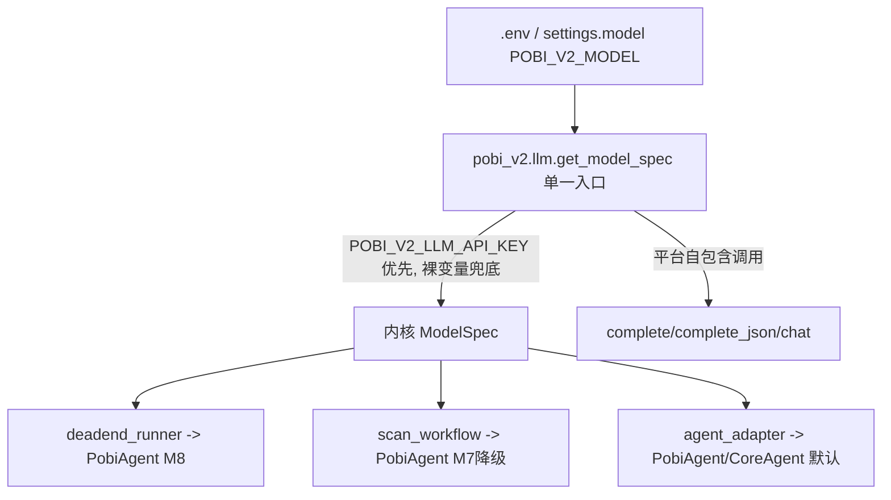

## 用户需求

平台应统一 LLM 配置与消费，收敛当前 4 套（3 处适配层 + 1 处孤儿抽象层）分散实现。

## 产品概述

建立平台唯一的 LLM 解析入口，消除多路径配置分叉，使 `POBI_V2_LLM_API_KEY` 等平台统一前缀凭证在所有执行路径（M8 主路径、M7 降级、默认 agent 路径、平台自包含问答/报告）均生效，并彻底接入内核 `PobiAgent`。

## 核心特性

- 单一解析入口：在 `pobi_v2/llm/` 落地统一 `get_model_spec()`，产出内核 `ModelSpec` 类型，删除自建 dataclass，消除类型壁垒。
- 凭证兼容策略：优先 `POBI_V2_LLM_API_KEY` / `POBI_V2_LLM_API_BASE`（平台单一前缀），缺失时按 provider 回退到裸供应商变量（`ANTHROPIC_API_KEY` 等），兼容现有 `.env`。
- 三处适配层归一：`deadend_runner`、`scan_workflow`、`agent_adapter` 均改调统一入口，移除各自 `_build_model_spec` 与差异化的环境变量映射表，消除 `OPEN_ROUTER_API_KEY` vs `OPENROUTER_API_KEY` 类不一致。
- 孤儿层接入：复用 `pobi_v2/llm/` 的 litellm+instructor+tenacity 封装作为平台 LLM 基础设施，内核 `PobiAgent` 直接消费统一入口产出的 `ModelSpec`，不再悬置。
- 字段去重：废弃语义重叠的 `settings.llm_model`（`POBI_V2_LLM_MODEL`），统一使用 `settings.model`（`POBI_V2_MODEL`）。

## 技术栈

- 沿用现有栈：Python + pydantic-settings（平台配置）、litellm + instructor + tenacity（LLM 基础设施）、pydantic（内核 `ModelSpec`）。
- 不引入新依赖；内核 `pobi_agent` 包保持独立，仅复用其 `ModelSpec` 类型与 `PobiAgent` 构造入口。

## 实现方案

**策略**：把 `pobi_v2/llm/` 改造为平台唯一 LLM 解析与调用入口。它复用内核 `pobi_agent.config.settings.ModelSpec`（pydantic），对外提供 `get_model_spec(model_str=None)`（统一解析）+ `to_litellm_model()`（格式转换）+ `complete/complete_json/chat`（平台自包含调用封装）。三条执行路径经此入口获取 `ModelSpec` 后喂给内核 `PobiAgent` / 降级 `CoreAgent` 适配，消除分叉。

**关键决策**：

1. 复用内核 `ModelSpec` 而非自建类型 —— 直接打通「彻底接入内核」的壁垒，避免双 `ModelSpec` 转换噪音。
2. 解析优先级：`settings.model` 拆 `provider/model_name` → 凭证取 `POBI_V2_LLM_API_KEY`，缺失按 provider 取裸变量 → base_url 取 `POBI_V2_LLM_API_BASE`，缺失按 provider 取裸变量。统一同一 provider 在所有路径读同一变量名。
3. 内核 `CoreAgent._call_llm` 裸串入口保留不动（兼容内核既有 CLI 调用），仅平台侧适配层统一经 `pobi_v2/llm` 产出 `ModelSpec` 后拆解喂入，不改内核内部逻辑，守住内核边界。
4. `settings.llm_model` 废弃：保留字段但标记 deprecated，解析入口不再消费，文档说明统一用 `settings.model`，避免双字段歧义。

**性能与可靠性**：解析为纯函数 + `lru_cache`，无 I/O 阻塞；统一入口保证凭证读取幂等，降级路径与主路径行为一致；保留 tenacity 重试与限流（`settings.llm_rate_limit_rpm`）不退化。

## 实现注意

- 复用现有 `pobi_v2/llm/config.py` 的 7 级优先级骨架，但改为产出内核 `ModelSpec` 并按上述凭证策略收敛，不要另起炉灶。
- `deadend_runner._PROVIDER_ENV` 与 `scan_workflow._MODEL_PROVIDER_HINTS` 删除后，其 provider→裸变量映射须并入统一入口的回退逻辑，且变量名以 `OPEN_ROUTER_API_KEY`（下划线）为准，避免回归。
- `agent_adapter.build_core_agent` 当前把 `settings.model` + `settings.llm_api_key` 直传裸串，需改为先经统一入口解析出 `ModelSpec`，再拆 `provider/model_name` + `api_key`/`api_base` 喂 `CoreAgent`。
- 删除 `pobi_v2/llm/types.py` 中的 `ModelSpec` dataclass，其余类型（`LLMMessage`/`LLMRequest`/`LLMResponse`/`UsageRecord`/`LLMError`）保留供 `complete/complete_json/chat` 使用。

## 架构设计

统一后数据流：



所有路径共用 B，凭证读取逻辑单一，消除分叉。

## 目录结构

```
pobi_v2/
├── core/config.py              # [MODIFY] 保留 model/llm_api_key/llm_api_base/llm_rate_limit_rpm；llm_model 标记 deprecated 不再被解析入口消费
├── llm/
│   ├── __init__.py             # [MODIFY] 导出统一 get_model_spec/to_litellm_model 与 complete 系列；ModelSpec 改引内核类型
│   ├── config.py               # [MODIFY] 重写为单一解析入口，产出内核 ModelSpec；凭证优先 POBI_V2_LLM_* 再裸变量兜底；移除 LLM_MODEL 兜底分支
│   ├── client.py               # [MODIFY] complete/complete_json/chat 改为接受内核 ModelSpec，复用 to_litellm_model
│   └── types.py                # [MODIFY] 删除 ModelSpec dataclass，保留其余平台调用类型
├── engine/
│   ├── deadend_runner.py       # [MODIFY] 删除 _build_model_spec/_PROVIDER_ENV，改调 pobi_v2.llm.get_model_spec
│   ├── scan_workflow.py        # [MODIFY] 删除 _build_model_spec/_MODEL_PROVIDER_HINTS，改调统一入口
│   ├── agent_adapter.py        # [MODIFY] build_core_agent/build_pobi_agent 经统一入口取 ModelSpec 再构造
│   └── executor.py             # [MODIFY] 三条路径统一经 pobi_v2.llm 获取 ModelSpec，消除入口分叉
└── tests/
    └── test_llm_resolve.py     # [NEW] 覆盖统一解析优先级、凭证兼容、provider 变量归一
```

## 关键代码结构

统一入口核心契约（接口级，精确约束集成点）：

```python
# pobi_v2/llm/config.py
from pobi_agent.config.settings import ModelSpec

def get_model_spec(model_str: str | None = None) -> ModelSpec:
    """唯一解析入口：model_str 缺省取 settings.model；凭证优先 POBI_V2_LLM_*，
    缺失按 provider 回退裸供应商变量；产出内核 ModelSpec。"""

def to_litellm_model(spec: ModelSpec) -> str:
    """内核 ModelSpec -> litellm 'provider/model' 调用名。"""
```