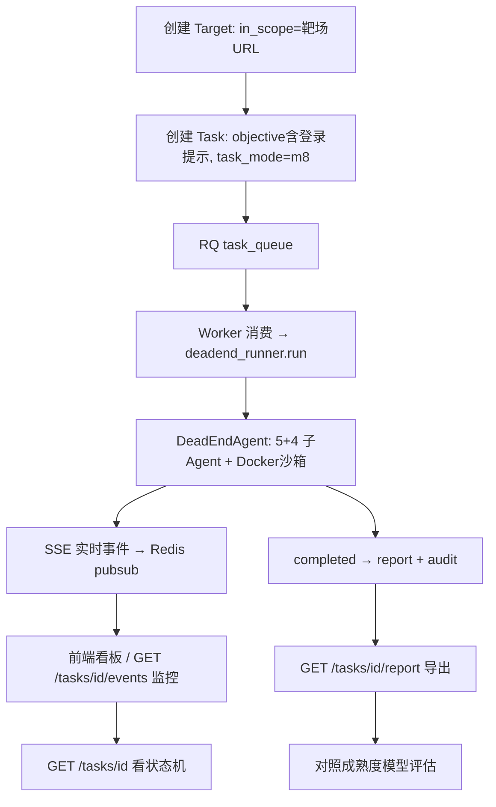

## 用户需求

在已具备 Docker 与 Web 平台运行环境的条件下，使用 DVWA 靶场（`http://122.51.72.186:8081`，security=medium，账号 `admin`/密码 `password`）跑通一个完整的 M8 实战引擎渗透任务；并通过平台现有能力（SSE 实时事件流、任务详情、报告导出、审计日志）监控任务执行过程，并对项目成熟度做量化评估。

## 产品概述

一次面向真实靶场的端到端实战引擎验证。用户不希望新写代码或独立监控脚本，而是复用平台既有接口与前端看板完成"运行—监控—评估"闭环。核心动作是：创建授权目标、创建带登录提示的任务、观察子 Agent 协同与状态机、导出报告、对照成熟度模型打分。

## 核心特性

- 创建授权目标（in_scope 含靶场地址），并据靶场需登录特性在任务 objective 中写入登录凭据提示，使 authenticator 子 Agent 可自动登录。
- 创建并触发 M8 完整引擎任务（Docker 沙箱可用，不走 ScanWorkflow 降级）。
- 通过浏览器看板 / SSE 接口实时监控子 Agent 活动、task_dict 状态机（pending→running→completed/failed）与 step_metrics。
- 任务完成后导出结构化报告（漏洞/证据），并结合审计日志评估项目成熟度（端到端跑通、子 Agent 协同、沙箱验证、报告可信度、组件健康）。

## 技术栈

- 后端：FastAPI（pobi_v2）+ RQ 任务队列 + Redis（事件总线/pubsub）+ PostgreSQL
- 引擎：pobi_agent DeadEndAgent（M8 完整多智能体）+ Docker 沙箱验证
- 前端：已有静态看板 `web/index.html` + `web/app.js`（订阅 SSE）
- 本次**不新增代码**，仅通过现有 HTTP API 与前端完成运行、监控、评估。

## 实现方案

### 总体策略

复用平台既有"创建目标→创建任务→入队→Worker 驱动 DeadEndAgent→SSE 实时流→报告/审计"链路，不改动任何源码。针对 DVWA 需登录的阻塞点，采用"把登录提示写入 Task.objective"的零代码注入方式（DeadEndAgent 会把 objective 注入 planner/authenticator 上下文，authenticator 子 Agent 据此尝试登录）。监控与成熟度评估全部基于现有 GET 接口与日志。

### 关键决策与权衡

1. **凭证注入方式**：Target 模型无认证字段、authenticator 工具不接收显式账号密码。把 `admin/password` 写进 objective 是零代码、最低侵入、可回滚的临时方案；后续若要长期化再考虑给 Target 增加 credentials 字段（超出本次范围）。
2. **M8 走通条件**：Docker 可用 → `deadend_runner.run()` 直接走完整引擎，不会因沙箱缺失降级到 M7。需确保 RQ worker 进程在运行且消费 `task_queue`。
3. **监控复用**：前端看板 `web/index.html` 已订阅 `/tasks/{id}/events` SSE，可直接观察 5+4 个子 Agent 的 thought/tool/confidence 与状态机；另用 `GET /tasks/{id}` 轮询 status/task_dict/step_metrics 做离线监控。
4. **成熟度评估维度**（对照 PROJECT_GOAL 的 M7/M8/M9 与待办 C1/C2/C3）：

- 端到端跑通率（任务是否 completed 且产出自洽报告）
- 子 Agent 协同完整性（planner/authenticator/attacker/recon/web_vuln_exploit + 4 generic 是否均被调度）
- Docker 沙箱验证回执（validation_receipt 是否生成、payload 是否在沙箱执行验证）
- 报告/证据可信度（findings 是否含 evidence、severity、confidence）
- 组件健康（靶场可达、模型连通、沙箱配额）
评估结论以对照表的"达成/部分/未达成"形式产出，不引入新存储。

## 实现备注

- **性能**：SSE 已由 `nginx.conf` 关闭代理缓冲且开启 Gzip，监控端直接订阅无需轮询高频拉取；状态查询建议间隔 ≥5s 避免压测 API。
- **安全红线**：靶场为已授权测试目标；严禁在任务中触发破坏性操作（清理靶场/重置容器）而无说明获批。agent_mode 默认 `hacker`（高危调用需审批），若需减少人工干预可在创建任务时指定 `yolo`（自动批准，仅限授权靶场）。
- **向后兼容**：不修改任何模型/接口/前端，仅通过参数与 objective 文本驱动，零回归风险。

## 架构与数据流



## 目录结构（本次不涉及代码改动）

仅列出将**被调用的现有文件/接口**，供执行参照：

```
pobi_v2/
├── api/tasks.py        # [现有] POST /tasks, GET /tasks/{id}, GET /tasks/{id}/report, POST /tasks/{id}/abort
├── api/sse.py          # [现有] GET /tasks/{id}/events (SSE 实时流)
├── engine/executor.py  # [现有] execute_task → build_deadend_runner → run
├── engine/deadend_runner.py  # [现有] M8 完整引擎构造与运行
├── db/models.py        # [现有] Target/Task 模型（无 credentials 字段）
└── web/
    ├── index.html      # [现有] 监控看板（订阅 SSE）
    └── app.js          # [现有] SSE 订阅与渲染
logs/
├── api.log / worker.log / worker_run.log  # [现有] 审计与运行日志
```